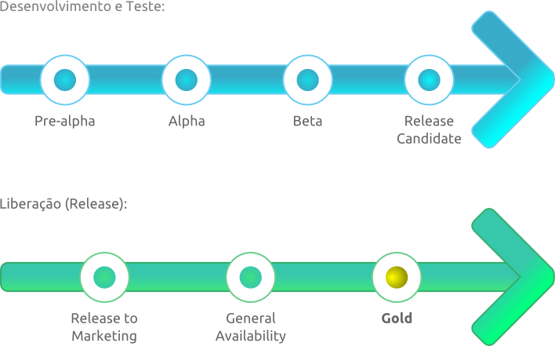

 

O [**Ciclo de vida para liberação de um software**](https://en.wikipedia.org/wiki/Software_release_life_cycle) consiste na soma dos estágios de desenvolvimento e amadurecimento para um fragmento de **Software**: abrangendo desde o seu desenvolvimento inicial até o seu lançamento, incluindo versões atualizadas que aplicam melhorias ou correções no **Software.**

Os estágios são:

## Pré-alfa (Pre-alpha)

Pré-alfa se refere à todas as atividades realizadas no projeto do **Software**, antes de ser testado, que podem ser: **Análise de requisitos**, **Design do Software**, **Testes unitários**, etc.

## Alfa (Alpha)

A fase alfa é a primeira onde se iniciam os testes do **Software**. Nela, são aplicadas algumas técnicas de teste, como a [**Caixa Branca**](https://en.wikipedia.org/wiki/White-box_testing). Validações adicionais são utilizadas por outra equipe, usando técnicas de [**Caixa Cinza**](https://en.wikipedia.org/wiki/Gray_box_testing) e [**Caixa Preta**](https://en.wikipedia.org/wiki/Black-box_testing).

O **Software** alfa pode ser instável, contendo *Bugs* e perda de dados, e pode não contar com todos os recursos planejados anteriormente.

## Beta (Beta)

A fase beta, geralmente, começa quando o **Software** está com os recursos completos, porém ainda suscetível à *Bugs*, problemas de performance e perda de dados.

O foco desta fase é **reduzir os impactos ao usuário**, aplicando testes de usabilidade.

Geralmente, é nesta fase onde os produtos estarão disponíveis do lado de fora da empresa que os desenvolveu, sendo utilizados em demonstrações, por exemplo.

## Candidato à Liberação (Release Candidate)

Nessa fase, o **Software** está em uma versão beta, mas com potencial para se tornar um produto final. Todos os recursos já foram planejados, implementados e testados sem reportar algum *Bug* significativo.

Ainda poderá haver alteração no código para consertar defeitos, mudanças na documentação e arquivos, e código externos para casos de teste.

Os testadores receberão essa versão para utilizá-la como produto final e a conduzirão para clientes, onde serão efetuados testes a partir de suas perspectivas.

## Liberação ao Mercado (Release to Marketing)

O produto está pronto para ser entregue para os clientes, contendo uma assinatura digital que garanta sua autenticidade.

Pode significar também, em outro contexto, que o **Software** já foi entregue para um cliente para instalação em seu respectivo *Hardware* de usuário final. O termo não define o mecanismo de entrega, mas apenas o estado de qualidade, que é suficiente para distribuição em massa.

## Disponibilidade Geral (General Availability)

Disponibilidade Geral é o estágio onde todas as atividades de comercialização necessárias já foram completadas e o produto está disponível no mercado.

Atividades de comercialização podem incluir testes de compilação e segurança, assim como localização e disponibilidade em escala global.

O tempo entre [**Liberação ao Mercado**](#rtm) e [**Disponibilidade Geral**](#ga) pode durar de uma semana a meses, em caso de atraso nas atividades de comercialização.

## Gold

O termo Gold se refere à versão mais atual do **Software** e pode incluir alguns *Patches*, ou até mesmo pacotes de serviços, que os usuários das versões [**Liberação ao Mercado**](#rtm) e [**Disponibilidade Geral**](#ga) teriam que baixar individualmente.

Pode incluir também alguns recursos extras ou *Addons* criados após as liberações anteriores.
